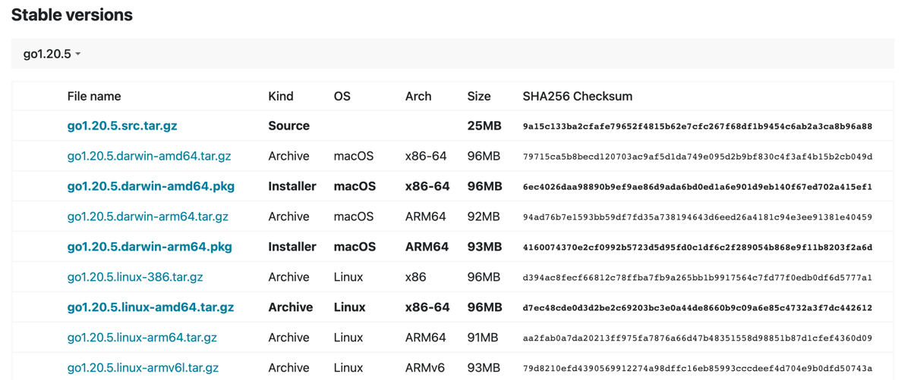

Hyperledgr Fabric 安装及示例部署

# 1环境准备.

## 1.1go相关

1.下载最新版本的go（参考https://golang.google.cn/doc/install ）

2.删除旧版本再解压新版本

进入新下载的go压缩包所在目录，sudo执行

```
 rm -rf /usr/local/go && tar -C /usr/local -xzf go1.20.4.linux-amd64.tar.gz
```

3.修改gopath、go代理

将下面代码写入  /etc/profile

```
export PATH=$PATH:/usr/local/go/bin
export GO111MODULE=on
export GOPROXY=https://goproxy.cn
```

更新配置

```
source /etc/profile
```

检查是否修改成功

```
go env
```


## 1.2 Docker

1.把系统更新到最新

```
sudo apt-get update
sudo apt-get upgrade
```

2.安装docker 和 docker compose

```
sudo apt-get install docker
sudo apt-get install docker-compose
```
或者运行本仓库docker.sh脚本

3.修改docker镜像仓库配置

修改/etc/docker/daemon.json文件，如果没有先建一个

```
sudo vim /etc/docker/daemon.json
```

修改配置文件

```
{
  "registry-mirrors": ["https://docker.mirrors.ustc.edu.cn"]
}
```

使配置文件生效

```
sudo systemctl daemon-reload
```

重启docker

```
sudo service docker restart
```

4.修改docker用户组（非必须）

添加docker用户组

```
sudo groupadd docker
```

把当前用户添加进docker用户组

```
sudo gpasswd -a $USER docker
```

更新用户组

```
newgrp docker
```

测试

```
docker version
```

# 2.Hyperledger Fabric

## 1.安装Hyperledger Fabric

1.下载本仓库bootstrap.sh脚本

推荐版本号：
```
VERSION=2.2.3        #fabric版本
CA_VERSION=1.5.0     #fabric-ca版本
```

2.执行bootstrap.sh

```
sudo bash bootstrap.sh
```

脚本执行三部分：

（下载docker镜像、下载fabric-sample项目文件、下载fabric二进制文件）

samples和二进制文件，网络不好可以手动下载，脚本内改为：

```
DOCKER=true
SAMPLES=fales
BINARIES=false
```


https://github.com/hyperledger/fabric/releases/download/v2.5.0/hyperledger-fabric-linux-amd64-2.5.0.tar.gz

https://github.com/hyperledger/fabric-ca/releases/download/v1.5.6/hyperledger-fabric-ca-linux-amd64-1.5.6.tar.gz

```
git clone https://github.com/hyperledger/fabric-samples
```

3.把二进制文件复制到/usr/local/bin

如果使用脚本下载则二进制文件存储路径为./fabric-samples/bin

## 2.使用Fabric的测试网络

参考 [使用Fabric的测试网络 — hyperledger-fabricdocs master 文档](https://hyperledger-fabric.readthedocs.io/zh_CN/release-2.2/test_network.html) 

# 3.使用本仓库的Fabric网络并测试性能
## 3.1 


安装npm

